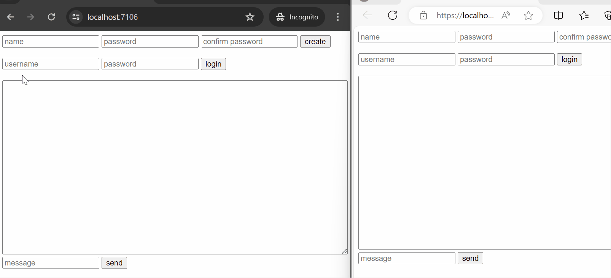

# SignalChat

SignalChat is a simple browser-based chat application using ASP.NET Core and SignalR.

SignalChat uses a n-tier architecture with services and repositories for simplicity. Instead of a full-blown message broker, it uses an in-memory queue and a background service to implement a decoupled bot that processes stock commands.



## Features

* Register users, login, and send messages in a chatroom
* Send `/stock=stock_code` as command
* Use stooq.com API to find the close price of a stock
* Show the latest 50 messages when joining a chatroom
* Include unit tests for validators, controller, and SignalR hubs

## Third-party tools used

* [password-hashing](https://github.com/defuse/password-hashing) to salt passwords
* [FluentValidation](https://github.com/FluentValidation/FluentValidation) for request validation
* [OrmLite](https://docs.servicestack.net/ormlite/) It's a simpler alternative to full-featured ORMs like EntityFramework Core or NHibernate
* [RestSharp](https://github.com/restsharp/RestSharp) to download CSV files from stooq.com API
* [CsvHelper](https://github.com/JoshClose/CsvHelper) to read and parse CSV files
* [Foundatio](https://github.com/FoundatioFx/Foundatio) to use in-memory queues and background jobs
* [SignalR_UnitTestingSupport](https://github.com/NightAngell/SignalR_UnitTestingSupport) to unit test SignalR hubs

## Installation

To install SignalChat, you need a .NET environment and a SQL Server instance up and running. SignalChat was developed and tested using .NET 8.0 and SQL Server 2019.

When SignalChat runs in "Development," it creates the required database and applies migrations, if needed.

### Using Docker

1. Clone this repository
1. On the root folder, run `docker-compose up -d`
1. Go to [](http://localhost:5000/)
1. Enjoy!

### Manually 

1. Clone this repository
1. Have a SQL Server instance up and running. Make sure to have credentials with enough permissions to create tables.
1. Inside your SQL Server instance, create a database called: `SignalChat`
1. Update the connection string inside the `appsettings.json` file in the `SignalChat` project to match your SQL Server instance.
1. Set the `SignalChat` project as the "Startup Project" and run it.
1. Enjoy!

As an alternative, you can choose to only use Docker to run a SQL Server instance. This is how to fire a local SQL Server instance:

```bash
$ docker run -d -p 1433:1433 -e "ACCEPT_EULA=Y" -e "SA_PASSWORD=<YourStrong@Passw0rd>" \
	--name sqlserver -h sqlserver \
	-d mcr.microsoft.com/mssql/server:2019-latest
```

## Usage

SignalChat has three endpoints:

* `POST api/account/register`
* `POST api/account/login`
* `GET api/message`

and one SignalR hub:

* `/chatHub`